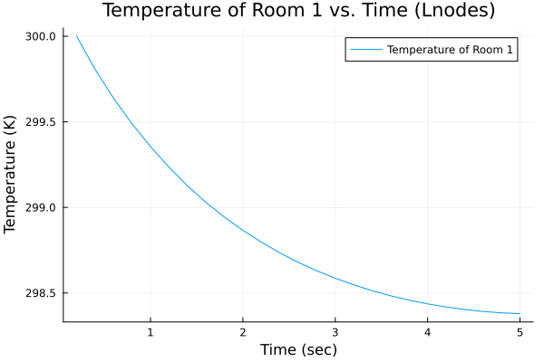

# Model Predictive Control: HVAC Example Part 1

By: Rishi Mandyam

1. Import the follwing packages into your file.

using JuMP
using Plasmo
using Ipopt
using Plots

2. Establish the constant values specified in the HVAC MPC Example Paper

```Julia
# Thermal Dynamics into and between rooms
rho_air = 1.225 # kg/m^3
V_room = 50 # m^3

#Ci = rho_air*V_room # mass of room i kg
Ci = 9163 
cp = 1012 # heat capacity of air in room (J/kg*K)
Ts = 16+273 # temp of supply air (K)
Toa = 293 # temp of outside air (K)
Rij = .004 # thermal resistance between rooms i and j (K/W)
Rioa = .057 # thermal resistance between room and outside (K/W)
Pid = 1 # disturbance term from weather forecast

#Ci*(dTi)=dt*(ui*cp*(Ts−Ti)+∑((Tj−Ti)/Rij+(Toa−Ti)/Rioa)+Pid)
```

3. Lets design our function.
This function will:

   - Create and optimize a graph of nodes that will model the:
     - Internal air temperature of a series of connceted rooms over time
     - Air flowrate into each room over time

The function inputs are:

- The number of nodes in the graph (N_U)
- the time in seconds between each node in the graph (dtu)
- The number of connected rooms in the system (num_rooms)
- The initial temperature of all rooms (K)
- The setpont temperature of the rooms (K)

The function will output:
- The solved graph (graph)
- An array containing each node of the graph (U_nodes)
  - Each of these nodes contains an array with the temperature values for each room

  - Lets create our function.
```julia
function HMPC_HVAC(N_U, dtu, num_rooms, T_init, Td)
```

Add the specified constraints
```julia
    Ti = [280, 310] # (K) Lower and upper bounds of the temperature values
    ui = [.005, 5] # (Kg/s) Lower and upper bounds of the air flowrate values
    Td_array = ones(num_rooms).*Td # Create an array containing the Td value with length equal to the number of rooms

```
       
Add the following tuning parameters (Calculated from Pareto Front)
```julia
    c1 = 0.2
    c2 = 0.8
```
    
Initialize the model
```julia
    HVAC = Model(Ipopt.Optimizer) # Initialize the model
    graph = OptiGraph() # initialize the optigraph
```

Node Initialization
```julia
    @optinode(graph, nodes[1:N_U]) # make a number of upperlayer nodes on the graph equal to N_U
```

In this loop we will iterate through the nodes and create variables and constraint on each of them.
```julia
    for (i, node) in enumerate(nodes)
        # The following variable is an array containing temperature values of each room
        @variable(node, Ti[1] <= T_hat_array[1:num_rooms] <= Ti[2], start = 300) 
        
        # This variable is an array containing airflowrates into each room
        @variable(node, ui[1] <= u_hat_array[1:num_rooms] <= ui[2], start = 1)
        #= 
        Since link-constraints have a difficult time dealing with nonlinear expressions, we will establish a 
        nonlinear dummy variable on each node that contains the nonlinear portion of the link-constraint expression.
        =#
        @variable(node, uT_U_array[1:num_rooms]) 
        for (j, uVal) in enumerate(node[:uT_U_array])
            @NLconstraint(node, uVal == u_hat_array[j]*cp*(Ts - T_hat_array[j]))
        end
```

Set the initial temperature of the rooms by creating this constraint on the first node. 
```julia
        if i == 1
            @constraint(node, [j = 1:num_rooms], node[:T_hat_array][j] == T_init)
        end
    end
```

Here we will add the Link Constraints between the nodes. 
```julia
    for node_Index in 1:(length(nodes)) # Iterate through each node
        for (room_num, T_room_num) in enumerate(nodes[node_Index][:T_hat_array][:,1]) # only use temps of rooms at earliest time
            if node_Index <= length(nodes) - 1 # Iterates through nodes with room number and temp arrays to create link constraints
```                

Rooms in this system are connected in a row so rooms can either be connected to one room or two rooms
```julia
                if room_num == 1 # if in the first room of the system
                    Tj = nodes[node_Index][:T_hat_array][room_num + 1, 1] # Get the temperature of the neighboring room (Tj)                
```
Link constraints will add constraints to values in two or more nodes.
These link-constraints will model how the temperature values of a room change over time. 
In this case we will use link-constraints to model how the temperature value of a room on one node
affects the temperature values of that room and its neighboring rooms on the next node.

```julia                    
                    @linkconstraint(graph, nodes[node_Index + 1][:T_hat_array][room_num] == 
                        dtu/Ci*(nodes[node_Index][:uT_U_array][room_num] + ((Tj − T_room_num)/Rij + (Toa − T_room_num)/Rioa) + Pid) + 
                        (nodes[node_Index][:T_hat_array][room_num])) # relationship between room temps
```
We will repeat this process for rightmost rooms and rooms that have two adjacent rooms.
```julia
                elseif room_num == num_rooms # if in the last last room of the system
                    Tj = nodes[node_Index][:T_hat_array][room_num - 1, 1] # Get the temperature of the neighboring room (Tj)
                    @linkconstraint(graph, (nodes[node_Index + 1][:T_hat_array][room_num]) == 
                        dtu/Ci*(nodes[node_Index][:uT_U_array][room_num] + ((Tj − T_room_num)/Rij + (Toa − T_room_num)/Rioa) + Pid) + 
                        (nodes[node_Index][:T_hat_array][room_num])) # relationship between room temps

                else # if in a room surrounded by 2 rooms
                    Tj1 = nodes[node_Index][:T_hat_array][room_num - 1, 1] # Get the temperature of the first neighboring room (Tj1)
                    Tj2 = nodes[node_Index][:T_hat_array][room_num + 1, 1] # Get the temperature of the second neighboring room (Tj2)
                    @linkconstraint(graph, (nodes[node_Index + 1][:T_hat_array][room_num]) == 
                        dtu/Ci*(nodes[node_Index][:uT_U_array][room_num] + ((Tj1 − T_room_num)/Rij + (Tj2 − T_room_num)/Rij + (Toa − T_room_num)/Rioa) + Pid) + 
                            (nodes[node_Index][:T_hat_array][room_num])) # relationship between room temps
                end
            end
        end
```
Add the objective function to each node to specify the optimization problem.
In this case we want to minimize:
- the difference between the current room temperature and the temperature setpoint
- the airflowrate into each room in order to conserve energy
        

```julia
        @objective(nodes[node_Index], Min, 
            (c1*(sum((nodes[node_Index][:T_hat_array][i] − Td_array[i]).^2 for i in (1:num_rooms))) 
            + (c2*sum(nodes[node_Index][:u_hat_array]).^2)).*dtu)
    end
```

Next we will set and call the optimizer.
Finally we will have the function return the graph and its nodes for analysis.
```julia
    # Set Optimizer
    set_optimizer(graph, Ipopt.Optimizer);
    set_optimizer_attribute(graph, "max_iter", 100);
    
    # Call the optimizer
    optimize!(graph);
    
    return graph, nodes
    
end
```

## Case 1:
Lets call our function with the following parameters.

- 20 Upper Layer Nodes
- 0.1 second Upper Layer Time Discritization
- 2 adjacent rooms
- Initial temperature of 300 K
- Setpoint temperature of 290 K

```julia
num_Unodes = 20
dtu = .5 # seconds
num_rooms = 2
T_init = 300 # Kelvin
Td = 290 # Kelvin

graph, nodes = HMPC_HVAC(num_Unodes, dtu, num_rooms, T_init, Td);
#   HMPC_HVAC(n_u, n_l, dtu, num_rooms)
```
## Display Optigraph
Lets see what our graph looks like.

```julia
using PlasmoPlots

plt_graph = layout_plot(graph,
            node_labels=true,
            markersize=40,
            labelsize=8,
            linewidth=1,
            layout_options=Dict(:tol=>.01,
                                :iterations=>100),
            plt_options=Dict(:legend=>false,
                             :framestyle=>:box,
                             :grid=>false,
                             :size=>(1100,1100),
                             :axis => nothing))
```

The graph shows our 20 labeled nodes in order. To check the temperature values of a room on a node, use the following code:


```julia
node = 1 # selected node
room = 2 # room number
print(value(nodes[node][:T_hat_array][room]))
```
## Set Up Plots

Lets observe the behavior of temperature over time for room 1. The following code stores the optimized temperature and airflowrate values into arrays we can plot.

```julia
# node Temps
Tr1Arr = zeros(length(nodes))
Ur1Arr = zeros(length(nodes))
tdArr = ones(length(nodes)).*Td
Dummy_r1_vals = zeros(length(nodes))
for (i, node)  in enumerate(nodes)
    Tr1Arr[i] = value(node[:T_hat_array][1]) # Temp values of Room 1 for each Unode
    Ur1Arr[i] = value(node[:u_hat_array][1]) # Airflow values of Room 1 for each Unode
    Dummy_r1_vals[i] = value(node[:uT_U_array][1]) # DummyVar values of Room 1 for each Unode
end
```
## Show Plots

### Plot 1: Temperature of room 1 over time

```julia
p1_X_axis = [1:length(Tr1Arr)].*dtu # Get X axis values
plot((p1_X_axis), Tr1Arr, 
    title = "Temperature of Room 1 vs. Time", 
    xlabel = "Time (sec)", 
    ylabel = "Temperature (K)", 
    label = "Temperature of Room 1",
    ylims = [285, 300])

plot!((p1_X_axis), tdArr,
    label = "Temperature Setpoint")
```


Plot 1 shows that the temperature of the room decreases from 300 K to approach the setpoint temperature of 290 K in the 10 second time frame.

### Plot 2: Airflowrate into room 1 over time

```julia
p1_X_axis = [1:length(Tr1Arr)].*dtu
plot((p1_X_axis), Ur1Arr, 
    title = "Air Flowrate into Room 1 vs. Time", 
    xlabel = "Time (sec)", 
    ylabel = "Air Flowrate (Kg/s)", 
    label = ["AirFlowrate into Room  One" "X Setpoint"])
```

Plot 2 shows that the air flowrate into room 1 decreases over time. This is expected because the temperature difference between the current state and the setpoint decreases over time. Due to this behavior, the control action to cool the room is large at the beginning and decreases over time. 


# Model Predictive Control Part 2: Heirarchical HVAC


#### Create getDTL Function
```julia
function getDTL(dtu, n_u, n_l)
    return(dtu/(n_l/n_u))
end
```

#### Create getUnodeIndex Function
```julia
function getUnodeIndex(nU, nL, Lnode_Index)
    return ceil(Int, Lnode_Index/(nL/nU))
end
```

#### Create getLnodePosition Function 
```julia
function getLnodePosition(nU, nL, Lnode_index)
    return Int(Lnode_index/(nL/nU))
end
```

#### Create getNeighboringRooms Function
This function returns a list of vectors where the index of the list is the room and the 
vectors are the neighboring rooms. 
This function assumes that the system of rooms are in a row.

```julia
function getNeighboringRooms(room, nrooms)
    if room == 1
        return [2,0]
    elseif room == nrooms
        return [nrooms - 1,0]
    else
        a = [room - 1,room + 1]
        return a
    end
end
```


```julia 
function HMPC_HVAC(n_u, n_l, dtu, num_rooms, T_initial, TdVal)

```
Add the constraints and objective variables

```julia
    Ti = [280, 310] # K Temp must be between these vals
    T_init = T_initial
    ui = 1 # must be within [.005, 5] # kg/s
    # Tuning Parameters (Calculated from Pareto Front)
    c1 = 0.2
    c2 = 0.8
```
 
#### Create the Setpoint Array:
This will establish a single temperature setpoint for each room in the system
```julia 
    Td_array = zeros(num_rooms)
    Td = TdVal # Change setpont val to check if control Action does anything
    for i in 1:num_rooms
        Td_array[i] = Td
    end
```
```julia
# function inputs
    n_rooms = num_rooms
    N_U = n_u # upper level nodes
    N_L = n_l # lower level nodes

    # Sampling periods (seconds)
    dt_U = dtu
    dt_L = getDTL(dtu,n_u,n_l)
```

initialize the graph and nodes
```julia
HVAC = Model(Ipopt.Optimizer)
    graph = OptiGraph()

    @optinode(graph, Unodes[1:N_U]) # make N_U upper layer nodes
    @optinode(graph, Lnodes[1:N_L]) # make N_L lower layer nodes
```
    

Upper Level Initialization
```julia
    for (i, Unode) in enumerate(Unodes)

        # array belonging to upper layer containing temps of each room in the node
        @variable(Unode, Ti[1] <= T_hat_U_array[1:n_rooms] <= Ti[2], start = 300)
            # row index: room number
            # column index: time

        # array belonging to upper layer containing airflowrate into each room
        @variable(Unode, .005 <= u_hat_U_array[1:n_rooms] <= 5, start = 1)
            # row index: room number
            # column index: time
        
        #Establish Nonlin Dummy Var
        @variable(Unode, uT_U_array[1:n_rooms])
        
        for (j, uVal) in enumerate(Unode[:uT_U_array])
            @NLconstraint(Unode, uVal == u_hat_U_array[j]*cp*(Ts - T_hat_U_array[j]))
        end
        
        # Set Initial Temperature of Rooms
        if i == 1
            @constraint(Unode, [j = 1:n_rooms], Unode[:T_hat_U_array][j] == T_init)
        end
        
        @objective(Unode, Min, sum(.01*(Unode[:T_hat_U_array] .- Td).^2 .+ 100*(Unode[:u_hat_U_array]).^2))
    end
```

Lower Level Initailization
```julia
    for (i, Lnode) in enumerate(Lnodes)
        @variable(Lnode, Ti[1] <= T_hat_L_array[1:n_rooms] <= Ti[2], start = 295) # temp of each room
        @variable(Lnode, .005 <= u_hat_L_array[1:n_rooms] <= 5, start = 1) # airflowrate of each room
        
        #Establish Nonlin Dummy Var
        @variable(Lnode, uT_L_array[1:n_rooms])
        
        for (j, lVal) in enumerate(Lnode[:uT_L_array])
            @NLconstraint(Lnode, lVal == u_hat_L_array[j]*cp*(Ts - T_hat_L_array[j]))
        end
        
        @variable(Lnode, T_0_LVal_array[1:n_rooms], start = 295) # T_0 vals belonging to Lnodes
        
        # Set Initial Temperature of Rooms
        if i == 1
            @constraint(Lnode, [j = 1:n_rooms], Lnode[:T_hat_L_array][j] == T_init)
        end

    end
```

Add the link constraints between Unodes
```julia
    for Unode_Index in 1:(length(Unodes))
        for (room_num, T_room_num) in enumerate(Unodes[Unode_Index][:T_hat_U_array][:,1]) # only use temps of rooms at earliest time
            if Unode_Index <= length(Unodes) - 1
                if room_num == 1 # if in the first room
                    Tj = Unodes[Unode_Index][:T_hat_U_array][room_num + 1, 1] # establish neighboring room
                    @linkconstraint(graph, Unodes[Unode_Index + 1][:T_hat_U_array][room_num] == 
                        dt_U/Ci*(Unodes[Unode_Index][:uT_U_array][room_num] + ((Tj − T_room_num)/Rij + (Toa − T_room_num)/Rioa) + Pid) + 
                        (Unodes[Unode_Index][:T_hat_U_array][room_num])) # relationship between room temps

                elseif room_num == n_rooms # if in the last last room
                    Tj = Unodes[Unode_Index][:T_hat_U_array][room_num - 1, 1]
                    @linkconstraint(graph, (Unodes[Unode_Index + 1][:T_hat_U_array][room_num]) == 
                        dt_U/Ci*(Unodes[Unode_Index][:uT_U_array][room_num] + ((Tj − T_room_num)/Rij + (Toa − T_room_num)/Rioa) + Pid) + 
                        (Unodes[Unode_Index][:T_hat_U_array][room_num])) # relationship between room temps

                else # if in a room surrounded by 2 rooms
                    Tj1 = Unodes[Unode_Index][:T_hat_U_array][room_num - 1, 1]
                    Tj2 = Unodes[Unode_Index][:T_hat_U_array][room_num + 1, 1]
                    @linkconstraint(graph, (Unodes[Unode_Index + 1][:T_hat_U_array][room_num]) == 
                        dt_U/Ci*(Unodes[Unode_Index][:uT_U_array][room_num] + ((Tj1 − T_room_num)/Rij + (Tj2 − T_room_num)/Rij + (Toa − T_room_num)/Rioa) + Pid) + 
                        (Unodes[Unode_Index][:T_hat_U_array][room_num])) # relationship between room temps
                end
            end
        end
        @objective(Unodes[Unode_Index], Min, 
            (c1*(sum((Unodes[Unode_Index][:T_hat_U_array][i, 1] − Td_array[i]).^2 for i in (1:n_rooms))) 
            + (c2*sum(Unodes[Unode_Index][:u_hat_U_array]).^2)).*dt_U)
        # 0.01∥T^u(s;tuk)−Td∥2+100∥u^(s;tk)∥2
    end
```

Add the link constraints between the Unodes and Lnodes
```julia
    # Link Constraints between Unodes and Lnodes
    for i in range(1,N_U) # loop through each U node
        for j in range(1,Int(N_L/N_U)) # loops through index of each subordinate Lnode at a time
            Lnode_Index = Int(j + N_L*(i - 1)/N_U)

            #create link constraint between them
            for room_index in range(1, n_rooms) # add a link constraint for each room

                # represent the room of the specific Lnode that the Unode i will link to 
                T_hat_l_room = Lnodes[Lnode_Index][:T_hat_L_array][room_index]

                # represent the upper layer temp solution for the lower layer
                T_0 = Unodes[i][:T_hat_U_array][room_index]
                
                # Makes T0 values the same between Unodes and Lnodes
                @linkconstraint(graph, T_0 == Lnodes[Lnode_Index][:T_0_LVal_array][room_index])
                
                #=
                @linkconstraint(graph, (T_hat_l_room) == 1/Ci*(ui*cp*(Ts − T_hat_l_room) 
                    + ((T_0 − T_hat_l_room)/Rij + (Toa − T_hat_l_room)/Rioa) + Pid))
                =#
                
            end
        end
    end
```

Add the link contraits between each Lnode
```julia
    for Lnode_Index in 1:(length(Lnodes)) # iterate through all Lnodes except for last
        for (room_num, T_room_num) in enumerate(Lnodes[Lnode_Index][:T_hat_L_array]) # iterate through each room
            if Lnode_Index <= length(Lnodes) - 1
            
                if room_num == 1 # if in the first room
                    Tj = Lnodes[Lnode_Index][:T_0_LVal_array][room_num + 1] # establish neighboring room
                    @linkconstraint(graph, Lnodes[Lnode_Index + 1][:T_hat_L_array][room_num] == 
                        dt_L/Ci*(Lnodes[Lnode_Index][:uT_L_array][room_num] + ((Tj − T_room_num)/Rij + (Toa − T_room_num)/Rioa) + Pid) + 
                        (Lnodes[Lnode_Index][:T_hat_L_array][room_num])) # relationship between room temps

                elseif room_num == n_rooms # if in the last last room
                    Tj = Lnodes[Lnode_Index][:T_0_LVal_array][room_num - 1]
                    @linkconstraint(graph, (Lnodes[Lnode_Index + 1][:T_hat_L_array][room_num]) == 
                        dt_L/Ci*(Lnodes[Lnode_Index][:uT_L_array][room_num] + ((Tj − T_room_num)/Rij + (Toa − T_room_num)/Rioa) + Pid) + 
                        (Lnodes[Lnode_Index][:T_hat_L_array][room_num])) # relationship between room temps

                else # if in a room surrounded by 2 rooms
                    Tj1 = Lnodes[Lnode_Index][:T_0_LVal_array][room_num - 1]
                    Tj2 = Lnodes[Lnode_Index][:T_0_LVal_array][room_num + 1]
                    @linkconstraint(graph, (Lnodes[Lnode_Index + 1][:T_hat_L_array][room_num]) == 
                        dt_L/Ci*(Lnodes[Lnode_Index][:uT_L_array][room_num] + ((Tj1 − T_room_num)/Rij + (Tj2 − T_room_num)/Rij + (Toa − T_room_num)/Rioa) + Pid) + 
                        (Lnodes[Lnode_Index][:T_hat_L_array][room_num])) # relationship between room temps
                end
            end
        end
```

Add the objective function to each Lnode
```julia       
        @objective(Lnodes[Lnode_Index], Min, 
            (c1.*sum(Lnodes[Lnode_Index][:T_hat_L_array] − Td_array).^2 + sum(Lnodes[Lnode_Index][:u_hat_L_array])^2)
             + c2.*sum(((Lnodes[Lnode_Index][:T_hat_L_array] − 
                    Lnodes[Lnode_Index][:T_0_LVal_array][:]).^2).*dt_L ))
        
    end
```

Set and call the optimizer
```julia
    # Set Optimizer
    set_optimizer(graph, Ipopt.Optimizer);
    set_optimizer_attribute(graph, "max_iter", 200);
    # Call the optimizer
    optimize!(graph);
    
    return graph, Unodes, Lnodes
    
end
```

## Case 1:
- 5 Upper Layer Nodes
- 25 Lower Layer Nodes
- 5 second time discretization between between Upper Layer nodes
- 2 adjacent rooms

Establish Variables and call the function
```julia
num_Unodes = 5
num_Lnodes = 25
dtu = 1 # seconds
num_rooms = 2
T_initial = 300
Td = 298

graph, Unodes, Lnodes = HMPC_HVAC(num_Unodes, num_Lnodes, dtu, num_rooms, T_initial, Td);
#   HMPC_HVAC(n_u, n_l, dtu, num_rooms)
```

### Plot the Optigraph
```julia
using PlasmoPlots

plt_graph = layout_plot(graph,
    node_labels=true,
    markersize=20,
    labelsize=4,
    linewidth=2,
    layout_options=Dict(:tol=>.01,
                        :iterations=>100),
    plt_options=Dict(:legend=>false,
                     :framestyle=>:box,
                     :grid=>false,
                     :size=>(800,800),
                     :axis => nothing))
```


##Plot the Temperature vs time graphs
```julia
# Lnode Temps
Tr1Arr = zeros(length(Lnodes))
Tr2Arr = zeros(length(Lnodes))

for (i, Lnode)  in enumerate(Lnodes)
    Tr1Arr[i] = value(Lnode[:T_hat_L_array][1])
    Tr2Arr[i] = value(Lnode[:u_hat_L_array][1])
end

# Unode Temps
Tr3Arr = zeros(length(Unodes))
Tr4Arr = zeros(length(Unodes))

for (i, Unode)  in enumerate(Unodes)
    Tr3Arr[i] = value(Unode[:T_hat_U_array][1])
    Tr4Arr[i] = value(Unode[:u_hat_U_array][1])
end

N = 8

xarray = Array{Array}(undef, 2)
xarray[2] = 0:10/(N-1):10

yarray = Array{Array}(undef, 2)
yarray[2] = 0:10/(N-1):10

zarray = Array{Array}(undef, 2)
zarray[2] = 0:10/(N-1):10
```

### Plot 1: Lnode Temperature vs. Time
```julia
# Get X axis values
p1_X_axis = [1:length(Tr1Arr)].*getDTL(dtu, num_Unodes, num_Lnodes)
plot((p1_X_axis), Tr1Arr, title = "Temperature of Room 1 vs. Time (Lnodes)", 
    xlabel = "Time (sec)", 
    ylabel = "Temperature (K)", 
    label = ["Temperature of Room 1" "X Setpoint"])
```


### Plot 2: Lnode Air Flowrate vs. Time
```julia
# Get X axis values
p2_X_axis = [1:length(Tr2Arr)].*getDTL(dtu, num_Unodes, num_Lnodes)
plot((p2_X_axis), Tr2Arr, title = "Air Flowrate into Room 1 vs. Time (Lnodes)", 
    xlabel = "Node (N)", 
    ylabel = "Flowrate (kg/s)", 
    label = ["Air Flowrate into Room 1" "X Setpoint"])
```


### Plot 3: Unode Temperature vs. Time
```julia
# Get X axis values
p3_X_axis = [1:length(Tr3Arr)].*dtu

plot((p3_X_axis), Tr3Arr, title = "Temp of Room 1 vs. Time (Unodes)", 
    xlabel = "Node (N)", 
    ylabel = "Temperature (K)", 
    label = ["Temperature of Room 1" "X Setpoint"])
```


### Plot 4: Unode AirFlowrate vs. Time
```julia
# Get X axis values
p4_X_axis = [1:length(Tr4Arr)].*dtu
plot((1:length(Tr4Arr)), Tr4Arr, title = "Air Flowrate into Room 1 vs. Time (Unodes)", 
    xlabel = "Node (N)", 
    ylabel = "Flowrate (kg/s)", 
    label = ["Air Flowrate into Room 1" "X Setpoint"])
```


## Case 2

- 5 Upper Layer Nodes
- 50 Lower Layer Nodes
- 5 second Upper Layer Time Discritization
- 4 adjacent rooms

```julia
num_Unodes = 2
num_Lnodes = 20
dtu = 1 # seconds
num_rooms = 6
T_initial = 300
Td = 298

graph, Unodes, Lnodes = HMPC_HVAC(num_Unodes, num_Lnodes, dtu, num_rooms, Td);
#   HMPC_HVAC(n_u, n_l, dtu, num_rooms)
```

## Show the Optigraph
```julia
using PlasmoPlots

plt_graph = layout_plot(graph,
            node_labels=true,
            markersize=20,
            labelsize=4,
            linewidth=2,
            layout_options=Dict(:tol=>.01,
                :iterations=>100),
            plt_options=Dict(:legend=>false,
                :framestyle=>:box,
                :grid=>false,
                :size=>(800,800),
                :axis => nothing))
```


## Plot the temp vs. time graphs
### Set up arrays for plotting
```julia
# Lnode Temps
Tr1Arr = zeros(length(Lnodes)) # Temperature Room 1 Array
Tr2Arr = zeros(length(Lnodes)) # Temperature Room 2 Array
Tr3Arr = zeros(length(Lnodes)) # Temperature Room 3 Array
Tr4Arr = zeros(length(Lnodes)) # Temperature Room 4 Array
Tr5Arr = zeros(length(Lnodes)) # Temperature Room 5 Array
Tr6Arr = zeros(length(Lnodes)) # Temperature Room 6 Array

ur1Arr = zeros(length(Lnodes)) # Flowrate into Room 1 Array
ur2Arr = zeros(length(Lnodes)) # Flowrate into Room 2 Array
ur3Arr = zeros(length(Lnodes)) # Flowrate into Room 3 Array
ur4Arr = zeros(length(Lnodes)) # Flowrate into Room 4 Array
ur5Arr = zeros(length(Lnodes)) # Flowrate into Room 5 Array
ur6Arr = zeros(length(Lnodes)) # Flowrate into Room 6 Array

for (i, Lnode)  in enumerate(Lnodes)
    Tr1Arr[i] = value(Lnode[:T_hat_L_array][1])cs
    Tr2Arr[i] = value(Lnode[:T_hat_L_array][2])
    Tr3Arr[i] = value(Lnode[:T_hat_L_array][3])
    Tr4Arr[i] = value(Lnode[:T_hat_L_array][4])
    Tr5Arr[i] = value(Lnode[:T_hat_L_array][5])
    Tr6Arr[i] = value(Lnode[:T_hat_L_array][6])
    
    ur1Arr[i] = value(Lnode[:u_hat_L_array][1])
    ur2Arr[i] = value(Lnode[:u_hat_L_array][2])
    ur3Arr[i] = value(Lnode[:u_hat_L_array][3])
    ur4Arr[i] = value(Lnode[:u_hat_L_array][4])
    ur5Arr[i] = value(Lnode[:u_hat_L_array][5])
    ur6Arr[i] = value(Lnode[:u_hat_L_array][6])
end

# Unode Temps
Tr1Arr_u = zeros(length(Unodes))
Tr2Arr_u = zeros(length(Unodes))
Tr3Arr_u = zeros(length(Unodes))
Tr4Arr_u = zeros(length(Unodes))
Tr5Arr_u = zeros(length(Unodes))
Tr6Arr_u = zeros(length(Unodes))

ur1Arr_u = zeros(length(Unodes))
ur2Arr_u = zeros(length(Unodes))
ur3Arr_u = zeros(length(Unodes))
ur4Arr_u = zeros(length(Unodes))
ur5Arr_u = zeros(length(Unodes))
ur6Arr_u = zeros(length(Unodes))

for (i, Unode)  in enumerate(Unodes)
    Tr1Arr_u[i] = value(Unode[:T_hat_U_array][1])
    Tr2Arr_u[i] = value(Unode[:T_hat_U_array][2])
    Tr3Arr_u[i] = value(Unode[:T_hat_U_array][3])
    Tr4Arr_u[i] = value(Unode[:T_hat_U_array][4])
    Tr5Arr_u[i] = value(Unode[:T_hat_U_array][5])
    Tr6Arr_u[i] = value(Unode[:T_hat_U_array][6])
    
    ur1Arr_u[i] = value(Unode[:u_hat_U_array][1])
    ur1Arr_u[i] = value(Unode[:u_hat_U_array][2])
    ur1Arr_u[i] = value(Unode[:u_hat_U_array][3])
    ur1Arr_u[i] = value(Unode[:u_hat_U_array][4])
    ur1Arr_u[i] = value(Unode[:u_hat_U_array][5])
    ur1Arr_u[i] = value(Unode[:u_hat_U_array][6])
end

```

### Plot 1 Lnode Temperature vs. Time
```julia
p1_X_axis = [1:length(Tr1Arr)].*getDTL(dtu, num_Unodes, num_Lnodes) # Plot 1 X Axis
plt = plot(p1_X_axis, Tr1Arr, 
    title = "Temperature of Room 1 vs. Time (Lnodes)", 
    xlabel = "Time (sec)", 
    ylabel = "Temperature (K)", 
    label = "Temperature of Room 1")
plot!(p1_X_axis, Tr2Arr, label = "Temperature of Room 2")
plot!(p1_X_axis, Tr3Arr, label = "Temperature of Room 3")
```


### Plot 2 Lnode Air Flowrate vs. Time
```julia
p2_X_axis = [1:length(ur1Arr)].*getDTL(dtu, num_Unodes, num_Lnodes)
plt = plot((p2_X_axis), [ur1Arr, ur2Arr, ur3Arr],
    title = "Air Flowrate into Rooms 1-3 vs. Time (Lnodes)", 
    xlabel = "Node (N)", 
    ylabel = "Flowrate (kg/s)", 
    )
```


### Plot 3 Unode vs. Temperature
```julia
p3_X_axis = [1:length(Tr3Arr_u)].*dtu
plt = plot((p3_X_axis), Tr3Arr_u, 
    title = "Temp of Room 1 vs. Time (Unodes)", 
    xlabel = "Time (sec)", 
    ylabel = "Temperature (K)", 
    label = ["Temperature of Room 1" "X Setpoint"])

```


### Plot 4 Unode vs. Air Flowrate
```julia
p4_X_axis = [1:length(Tr4Arr)].*dtu
plot((1:length(Tr4Arr)), ur4Arr, 
    title = "Air Flowrate into Room 1 vs. Time (Unodes)", 
    xlabel = "Time (sec)", 
    ylabel = "Flowrate (kg/s)", 
    label = ["Air Flowrate into Room 1" "X Setpoint"])
```


# Case 3 (Varying Temperature Setpoints)

- 10 Upper Layer Nodes
- 200 Lower Layer Nodes
- 1 second Upper Layer Time Discritization
- 4 adjacent rooms

Let's recreate the function with an additional input for
a temperature set-point array.

The new function should now look like this
```julia
function HMPC_HVAC_VaryingSetpointTemps(n_u, n_l, dtu, num_rooms, Td_array, Pid_Array, T_initial)
# find constraints, objective variables, setpoints,
    
    # Constraints:
    Ti = [280, 310] # K Room temps must be between these vals
    T_init = T_initial # Initial temp of room at time t = 0
    
    
    # Temp Setpoints over time
    Td_matrix = zeros(num_rooms, length(Td_array))
    for (i, temp) in enumerate(Td_array)
        Td_matrix[:, i] .= temp
    end
    
    ui = 1 # must be within [.005, 5] # kg/s

    # Tuning Parameters (Calculated from Pareto Front)
    c1 = 0.2
    c2 = 0.8

    # Objective variables
    # Ti must be within 20 and 24 

    # function inputs
    n_rooms = num_rooms
    N_U = n_u # upper level nodes
    N_L = n_l # lower level nodes

    # Sampling periods (seconds)
    dt_U = dtu
    dt_L = getDTL(dtu,n_u,n_l)

    # Time Horizons
    horiz_U = 24*60*60 # seconds
    horiz_L = 2*60*60 # seconds

    HVAC = Model(Ipopt.Optimizer)
    graph = OptiGraph()

    @optinode(graph, Unodes[1:N_U]) # make N_U upper layer nodes
    @optinode(graph, Lnodes[1:N_L]) # make N_L lower layer nodes

    # Upper Layer Initialization
    for (i, Unode) in enumerate(Unodes)

        # array belonging to upper layer containing temps of each room in the node
        @variable(Unode, Ti[1] <= T_hat_U_array[1:n_rooms] <= Ti[2], start = 300)
            # row index: room number
            # column index: time

        # array belonging to upper layer containing airflowrate into each room
        @variable(Unode, 0 <= u_hat_U_array[1:n_rooms] <= 5, start = 1)
            # row index: room number
            # column index: time
        
        #Establish Nonlin Dummy Var
        @variable(Unode, uT_U_array[1:n_rooms])
        
        for (j, uVal) in enumerate(Unode[:uT_U_array])
            @NLconstraint(Unode, uVal == u_hat_U_array[j]*cp*(Ts - T_hat_U_array[j]))
        end
        
        # Set Initial Temperature of Rooms
        if i == 1
            @constraint(Unode, [j = 1:n_rooms], Unode[:T_hat_U_array][j] == T_init)
        end
    end

    # Lower Layer Initailization
    for (i, Lnode) in enumerate(Lnodes)
        @variable(Lnode, Ti[1] <= T_hat_L_array[1:n_rooms] <= Ti[2], start = 295) # temp of each room
        @variable(Lnode, .005 <= u_hat_L_array[1:n_rooms] <= 5, start = 1) # airflowrate of each room
        
        #Establish Nonlin Dummy Var
        @variable(Lnode, uT_L_array[1:n_rooms])
        
        for (j, lVal) in enumerate(Lnode[:uT_L_array])
            @NLconstraint(Lnode, lVal == u_hat_L_array[j]*cp*(Ts - T_hat_L_array[j]))
        end
        
        @variable(Lnode, T_0_LVal_array[1:n_rooms], start = 295) # T_0 vals belonging to Lnodes
        
        # Set Initial Temperature of Rooms
        if i == 1
            @constraint(Lnode, [j = 1:n_rooms], Lnode[:T_hat_L_array][j] == T_init)
        end

    end
    

    # Link Constraints between Unodes
    for Unode_Index in 1:(length(Unodes))
        for (room_num, T_room_num) in enumerate(Unodes[Unode_Index][:T_hat_U_array][:,1]) # only use temps of rooms at earliest time
            if Unode_Index <= length(Unodes) - 1
                if room_num == 1 # if in the first room
                    Tj = Unodes[Unode_Index][:T_hat_U_array][room_num + 1, 1] # establish neighboring room
                    @linkconstraint(graph, Unodes[Unode_Index + 1][:T_hat_U_array][room_num] == 
                        dt_U/Ci*(Unodes[Unode_Index][:uT_U_array][room_num] + ((Tj − T_room_num)/Rij + (Toa − T_room_num)/Rioa) + Pid_Array[Unode_Index]) + 
                        (Unodes[Unode_Index][:T_hat_U_array][room_num])) # relationship between room temps

                elseif room_num == n_rooms # if in the last last room
                    Tj = Unodes[Unode_Index][:T_hat_U_array][room_num - 1, 1]
                    @linkconstraint(graph, (Unodes[Unode_Index + 1][:T_hat_U_array][room_num]) == 
                        dt_U/Ci*(Unodes[Unode_Index][:uT_U_array][room_num] + ((Tj − T_room_num)/Rij + (Toa − T_room_num)/Rioa) + Pid_Array[Unode_Index]) + 
                        (Unodes[Unode_Index][:T_hat_U_array][room_num])) # relationship between room temps

                else # if in a room surrounded by 2 rooms
                    Tj1 = Unodes[Unode_Index][:T_hat_U_array][room_num - 1, 1]
                    Tj2 = Unodes[Unode_Index][:T_hat_U_array][room_num + 1, 1]
                    @linkconstraint(graph, (Unodes[Unode_Index + 1][:T_hat_U_array][room_num]) == 
                        dt_U/Ci*(Unodes[Unode_Index][:uT_U_array][room_num] + ((Tj1 − T_room_num)/Rij + (Tj2 − T_room_num)/Rij + (Toa − T_room_num)/Rioa) + Pid_Array[Unode_Index]) + 
                        (Unodes[Unode_Index][:T_hat_U_array][room_num])) # relationship between room temps
                end
            end
        end
        
        @objective(Unodes[Unode_Index], Min, 
            (c1*(sum((Unodes[Unode_Index][:T_hat_U_array][i] − Td_matrix[i, Unode_Index]).^2 for i in (1:n_rooms)))
            + (c2*sum(Unodes[Unode_Index][:u_hat_U_array]).^2)).*dt_U)
        # 0.01∥T^u(s;tuk)−Td∥2+100∥u^(s;tk)∥2
    end


    # Link Constraints between Unodes and Lnodes
    for i in range(1,N_U) # loop through each U node
        for j in range(1,Int(N_L/N_U)) # loops through index of each subordinate Lnode at a time
            Lnode_Index = Int(j + N_L*(i - 1)/N_U)

            #create link constraint between them
            for room_index in range(1, n_rooms) # add a link constraint for each room

                # represent the room of the specific Lnode that the Unode i will link to 
                T_hat_l_room = Lnodes[Lnode_Index][:T_hat_L_array][room_index]

                # represent the upper layer temp solution for the lower layer
                T_0 = Unodes[i][:T_hat_U_array][room_index]
                
                # Makes T0 values the same between Unodes and Lnodes
                @linkconstraint(graph, T_0 == Lnodes[Lnode_Index][:T_0_LVal_array][room_index])
                
            end
        end
    end


    # Link Constraints Between Lnodes
    for Lnode_Index in 1:(length(Lnodes)) # iterate through all Lnodes except for last
        
        for (room_num, T_room_num) in enumerate(Lnodes[Lnode_Index][:T_hat_L_array]) # iterate through each room
            if Lnode_Index <= length(Lnodes) - 1
            
                if room_num == 1 # if in the first room
                    Tj = Lnodes[Lnode_Index][:T_0_LVal_array][room_num + 1] # establish neighboring room
                    @linkconstraint(graph, Lnodes[Lnode_Index + 1][:T_hat_L_array][room_num] == 
                        dt_L/Ci*(Lnodes[Lnode_Index][:uT_L_array][room_num] + ((Tj − T_room_num)/Rij + (Toa − T_room_num)/Rioa) + Pid_Array[getUnodeIndex(N_U, N_L, Lnode_Index)]) + 
                        (Lnodes[Lnode_Index][:T_hat_L_array][room_num])) # relationship between room temps

                elseif room_num == n_rooms # if in the last last room
                    Tj = Lnodes[Lnode_Index][:T_0_LVal_array][room_num - 1]
                    @linkconstraint(graph, (Lnodes[Lnode_Index + 1][:T_hat_L_array][room_num]) == 
                        dt_L/Ci*(Lnodes[Lnode_Index][:uT_L_array][room_num] + ((Tj − T_room_num)/Rij + (Toa − T_room_num)/Rioa) + Pid_Array[getUnodeIndex(N_U, N_L, Lnode_Index)]) + 
                        (Lnodes[Lnode_Index][:T_hat_L_array][room_num])) # relationship between room temps

                else # if in a room surrounded by 2 rooms
                    Tj1 = Lnodes[Lnode_Index][:T_0_LVal_array][room_num - 1]
                    Tj2 = Lnodes[Lnode_Index][:T_0_LVal_array][room_num + 1]
                    @linkconstraint(graph, (Lnodes[Lnode_Index + 1][:T_hat_L_array][room_num]) == 
                        dt_L/Ci*(Lnodes[Lnode_Index][:uT_L_array][room_num] + ((Tj1 − T_room_num)/Rij + (Tj2 − T_room_num)/Rij + (Toa − T_room_num)/Rioa) + Pid_Array[getUnodeIndex(N_U, N_L, Lnode_Index)]) + 
                        (Lnodes[Lnode_Index][:T_hat_L_array][room_num])) # relationship between room temps
                end
            end
        end
        Unode_index = Int(ceil(Lnode_Index/(n_l/n_u))) 
        
        @objective(Lnodes[Lnode_Index], Min, 
            (c1.*sum(Lnodes[Lnode_Index][:T_hat_L_array] − Td_matrix[:,Unode_index]).^2 + sum(Lnodes[Lnode_Index][:u_hat_L_array])^2)
             + c2.*sum(((Lnodes[Lnode_Index][:T_hat_L_array] − 
                    Lnodes[Lnode_Index][:T_0_LVal_array][:]).^2).*dt_L ))
        
    end

    # Set Optimizer
    set_optimizer(graph, Ipopt.Optimizer);
    set_optimizer_attribute(graph, "max_iter", 100);
    # Call the optimizer
    optimize!(graph);
    
    return graph, Unodes, Lnodes
    
end
```
Estabish the Case #3 Function Inputs
```julia
num_Unodes = 10
num_Lnodes = 200
dtu = 1
num_rooms = 2
```

Create Temperature Set-point array (Td_array)
```julia
r = range(1, 5, num_Unodes)
#Td_array = 290*ones(length(r))
Td_array = 4 ./ (r) .+ 291
T_initial = Td_array[1]
```

Create Pid Array
```julia
pid_Offset = 10
pidVal = range(0, 2*pi, num_Unodes)
Pid_Array = 5000*sin.(pidVal) .+ pid_Offset
#Pid_Array = 1000*ones(length(pidVal))
```

```julia
graph, Unodes, Lnodes = HMPC_HVAC_VaryingSetpointTemps(
    num_Unodes, num_Lnodes, dtu, num_rooms, Td_array, Pid_Array, T_initial);
```

### Visualize Temperature Set-point Over Time

```julia
time = num_Unodes*dtu
plot(Td_array,
    title = "Temperature Setpoints of All Rooms", 
    xlabel = "Unode Index", 
    ylabel = "Temperature (K)",
    label = "Temperature")
```

### Visualize Pid values on each Unode

```julia
time = num_Unodes*dtu
plot(Pid_Array,
    title = "Pid Values for Each Time Point", 
    xlabel = "Unode Index", 
    ylabel = "Pid Value (K)",
    label = "Pid Value")
```

### Show the Graph of Nodes
```julia
using PlasmoPlots

plt_graph = layout_plot(graph,
            node_labels=true,
            markersize=20,
            labelsize=4,
            linewidth=2,
            layout_options=Dict(:tol=>.01,
                :iterations=>100),
            plt_options=Dict(:legend=>false,
                 :framestyle=>:box,
                 :grid=>false,
                 :size=>(800,800),
                 :axis => nothing))
```


## Set up Arrays for Plotting
```julia
# Lnode Temps
Tr1Arr = zeros(length(Lnodes)) # Temperature Room 1 Array
Tr2Arr = zeros(length(Lnodes)) # Temperature Room 2 Array
Tr3Arr = zeros(length(Lnodes)) # Temperature Room 3 Array
Tr4Arr = zeros(length(Lnodes)) # Temperature Room 4 Array
Tr5Arr = zeros(length(Lnodes)) # Temperature Room 5 Array
Tr6Arr = zeros(length(Lnodes)) # Temperature Room 6 Array

ur1Arr = zeros(length(Lnodes)) # Flowrate into Room 1 Array
ur2Arr = zeros(length(Lnodes)) # Flowrate into Room 2 Array
ur3Arr = zeros(length(Lnodes)) # Flowrate into Room 3 Array
ur4Arr = zeros(length(Lnodes)) # Flowrate into Room 4 Array
ur5Arr = zeros(length(Lnodes)) # Flowrate into Room 5 Array
ur6Arr = zeros(length(Lnodes)) # Flowrate into Room 6 Array

for (i, Lnode)  in enumerate(Lnodes)
    Tr1Arr[i] = value(Lnode[:T_hat_L_array][1])
    Tr2Arr[i] = value(Lnode[:T_hat_L_array][2])
    if num_rooms == 6
        Tr3Arr[i] = value(Lnode[:T_hat_L_array][3])
        Tr4Arr[i] = value(Lnode[:T_hat_L_array][4])
        Tr5Arr[i] = value(Lnode[:T_hat_L_array][5])
        Tr6Arr[i] = value(Lnode[:T_hat_L_array][6])
    end
    
    ur1Arr[i] = value(Lnode[:u_hat_L_array][1])
    ur2Arr[i] = value(Lnode[:u_hat_L_array][2])
    if num_rooms == 6
        ur3Arr[i] = value(Lnode[:u_hat_L_array][3])
        ur4Arr[i] = value(Lnode[:u_hat_L_array][4])
        ur5Arr[i] = value(Lnode[:u_hat_L_array][5])
        ur6Arr[i] = value(Lnode[:u_hat_L_array][6])
    end
end

# Unode Temps
Tr1Arr_u = zeros(length(Unodes))
Tr2Arr_u = zeros(length(Unodes))
Tr3Arr_u = zeros(length(Unodes))
Tr4Arr_u = zeros(length(Unodes))
Tr5Arr_u = zeros(length(Unodes))
Tr6Arr_u = zeros(length(Unodes))

ur1Arr_u = zeros(length(Unodes))
ur2Arr_u = zeros(length(Unodes))
ur3Arr_u = zeros(length(Unodes))
ur4Arr_u = zeros(length(Unodes))
ur5Arr_u = zeros(length(Unodes))
ur6Arr_u = zeros(length(Unodes))

for (i, Unode)  in enumerate(Unodes)
    Tr1Arr_u[i] = value(Unode[:T_hat_U_array][1])
    Tr2Arr_u[i] = value(Unode[:T_hat_U_array][2])
    if num_rooms == 6
        Tr3Arr_u[i] = value(Unode[:T_hat_U_array][3])
        Tr4Arr_u[i] = value(Unode[:T_hat_U_array][4])
        Tr5Arr_u[i] = value(Unode[:T_hat_U_array][5])
        Tr6Arr_u[i] = value(Unode[:T_hat_U_array][6])
    end

    ur1Arr_u[i] = value(Unode[:u_hat_U_array][1])
    ur1Arr_u[i] = value(Unode[:u_hat_U_array][2])
    if num_rooms == 6
        ur1Arr_u[i] = value(Unode[:u_hat_U_array][3])
        ur1Arr_u[i] = value(Unode[:u_hat_U_array][4])
        ur1Arr_u[i] = value(Unode[:u_hat_U_array][5])
        ur1Arr_u[i] = value(Unode[:u_hat_U_array][6])
    end
end

N = 8

xarray = Array{Array}(undef, 2)
xarray[2] = 0:10/(N-1):10

yarray = Array{Array}(undef, 2)
yarray[2] = 0:10/(N-1):10

zarray = Array{Array}(undef, 2)
zarray[2] = 0:10/(N-1):10
```

### Plot 1: Lnodes Temperature vs Time
```julia
# Get X axis values
p1_X_axis = [1:length(Tr1Arr)].*getDTL(dtu, num_Unodes, num_Lnodes) # Plot 1 X Axis
plot(p1_X_axis, Tr1Arr, 
    title = "Temperature of Room 1 vs. Time (Lnodes)", 
    xlabel = "Time (s)", 
    ylabel = "Temperature (K)", 
    label = "Temperature of Room 1",
    linecolor = "blue")
```


### Plot 2: Lnodes Air Flowrate vs. Time
```julia
p1_X_axis = [1:length(ur1Arr)].*getDTL(dtu, num_Unodes, num_Lnodes) # Plot 1 X Axis
plot(p1_X_axis, ur1Arr,
    title = "AirFlowrate into Room 1 vs. Time (Lnodes)", 
    xlabel = "Time (s)", 
    ylabel = "Air Flowrate (kg/s)", 
    label = "Airflowrate into Room 1",
    linecolor = "blue")
```


### Plot 3: Unodes and Lnodes Temperature vs Time
```julia
# Get X axis values
p1_X_axis = [1:length(Tr1Arr_u)].*dtu # Plot 1 X Axis
plot(p1_X_axis, Tr1Arr_u, 
    title = "Temperature of Room 1 vs. Time (Unodes)", 
    xlabel = "Time (sec)", 
    ylabel = "Temperature (K)", 
    label = "Temperature of Room 1 (Unodes)",
    linecolor = "orange")
```


### Plot 4: Unodes Air Flowrate vs. Time
```julia
# Get X axis values
p1_X_axis = [1:length(ur1Arr_u)].*dtu # Plot 1 X Axis
plot(p1_X_axis, ur1Arr_u, 
    title = "Flowrate of Room 1 vs. Time (Unodes)", 
    xlabel = "Time (sec)", 
    ylabel = "Air Flowrate (kg/s)", 
    label = "Air Flowrate into Room 1",
    linecolor = "orange")
```


# Conclusion
In this tutorial you learned how to hierarchical model predictive control to
model and control the behavior of a series of neighboring rooms. 